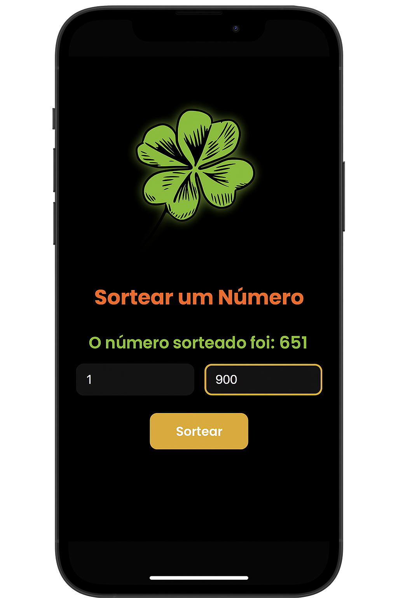

# 🎲 Sorteador de Números

Bem-vindo ao **Sorteador de Números**, um projeto simples, bonito e funcional feito com **HTML**, **CSS** e **JavaScript**. Ideal para quem quer sortear números entre dois valores definidos, com um toque visual moderno e responsivo — e até um trevo da sorte 🍀!

---

## 📱 Visual Responsivo

O app foi pensado para funcionar bem em qualquer dispositivo, inclusive em celulares. Veja abaixo uma prévia da interface:

  

---

## 🚀 Funcionalidades

Este projeto foi desenvolvido com o objetivo de treinar conceitos fundamentais de **JavaScript**, como manipulação do DOM, validação de dados, geração de números aleatórios e uso de funções.
A aplicação permite ao usuário inserir um valor mínimo e máximo, realiza a verificação para garantir que o intervalo seja válido, e então sorteia um número aleatório dentro desse intervalo. 
O resultado é exibido diretamente na tela, sem uso de alertas, proporcionando uma experiência mais fluida.
Além disso, o projeto conta com uma interface estilizada usando **CSS3**, incluindo animações suaves e responsividade para diferentes tamanhos de tela.
Também foi implementado um efeito visual no título da aba do navegador, que se movimenta continuamente, dando um toque dinâmico à aplicação. 
O layout foi construído com **HTML5**, e as fontes foram personalizadas com o uso do Google Fonts, garantindo um visual moderno e agradável.

---

## 🧠 Tecnologias Utilizadas

- **HTML5**  
- **CSS3**  
- **JavaScript (ES6+)**  
- **Google Fonts (Poppins & Roboto)**  

---

## ✨  Se você quiser ver meu projeto em ação, vá em:
https://adriciachiarini.github.io/sorteador
